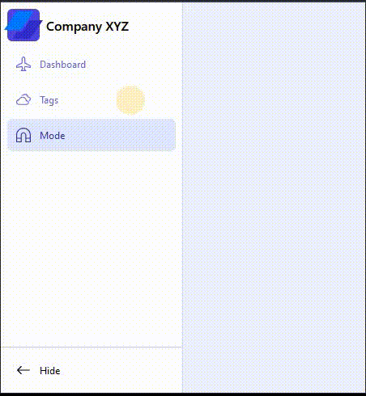

# Framer React - Sidebar

# 🔗 [Live Preview](https://playful-flan-119661.netlify.app/)

---

## About Project 👋

Just a simple retractable sidebar in which i practice implementation of framer motion.

---

## Features 👨‍💻

- **Sidebar:** Retracting sidebar when clicked on the button.

---

## How it works ⚙️

- All the components are piled up into one component so that they are easily editable and implementable into other project.

---

## Technologies & Dependencies used 📦

- **React:** useState, conditionals

- **Framer:** motion component

dependencies:

- "framer-motion": "^11.11.8",
- "react": "^18.3.1",
- "react-dom": "^18.3.1",
- "react-icons": "^5.3.0"

devDependencies:

- "@eslint/js": "^9.9.0",
- "@types/react": "^18.3.3",
- "@types/react-dom": "^18.3.0",
- "@vitejs/plugin-react": "^4.3.1",
- "autoprefixer": "^10.4.20",
- "eslint": "^9.9.0",
- "eslint-plugin-react": "^7.35.0",
- "eslint-plugin-react-hooks": "^5.1.0-rc.0",
- "eslint-plugin-react-refresh": "^0.4.9",
- "globals": "^15.9.0",
- "postcss": "^8.4.47",
- "tailwindcss": "^3.4.13",
- "vite": "^5.4.1"

---

## Prerequisites 📚

Ensure you have the following installed on your system:

    Node.js v18.00.0
    npm or yarn

---

## Clone & Run locally 🏃‍♂️

1. **Clone the Repository:**

   - On the GitHub repo page, click the green "Code" button.

   - Copy the HTTPS URL.

2. **Open the Terminal:**

   - Open the terminal by typing "cmd" in your desktop's start menu, **OR**

   - Right-click on the desktop and select "Git Bash Here" (if you have Git Bash installed), **OR**

   - Open Visual Studio Code's terminal by clicking "Terminal" -> "New Terminal" inside the editor.

3. **Navigate to Your Project Location:**

   - In the terminal, navigate to your desired location (e.g., desktop) using the command: `cd desktop`. Adjust the path if your project is located elsewhere.

   - Ensure that your terminal's address is inside the project folder.

4. **Clone the Repository:**

   - Run the command: `git clone /link/`. Replace `/link/` with the HTTPS URL from step 1.

5. **Enter the Project Directory:**

   - Navigate into the cloned repository by typing: `cd /folder-name/`. Replace `/folder-name/` with the name of the cloned folder.

6. **Install Dependencies:**

   - Run the command: `npm install` to install all the necessary dependencies.

7. **Start the Project:**

   - Run the command: `npm run dev` or `yarn dev` to start the project. You will need to manually open the browser address at [localhost:5173/](http://localhost:5173/)

---

## Project Structure 📂

    project-name/
    ├── public
    ├── src
    │ ├── assets
    │ ├── App.jsx
    │ ├── index.css
    │ ├── main.jsx
    │ ├── RetractingSideBar.jsx
    ├── package.json
    └── README.md
    └── configs
    └── others

---

## Contributing 💻

Contributions are closed at the moment but feel free to clone and experiment !
